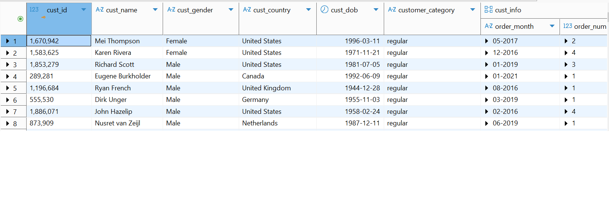
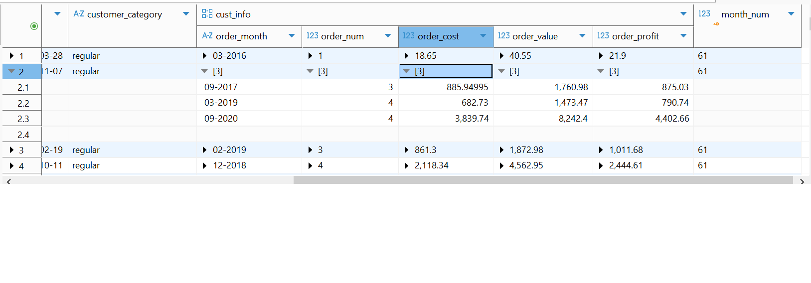
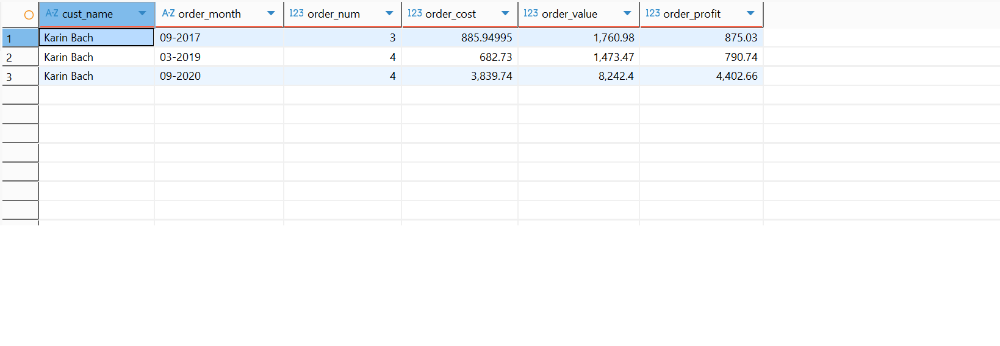
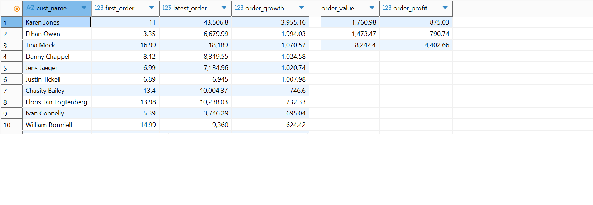
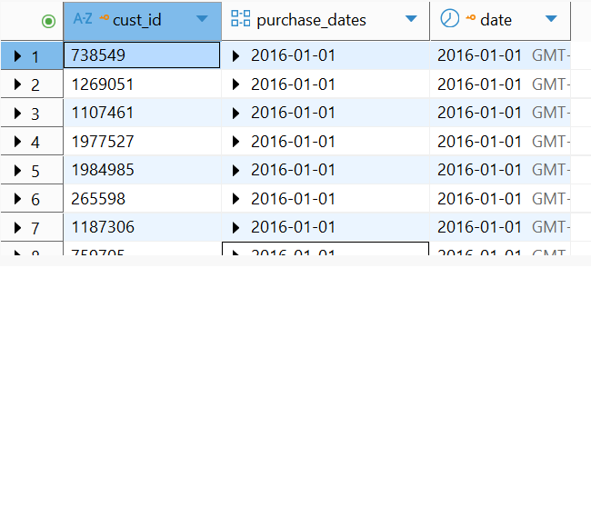
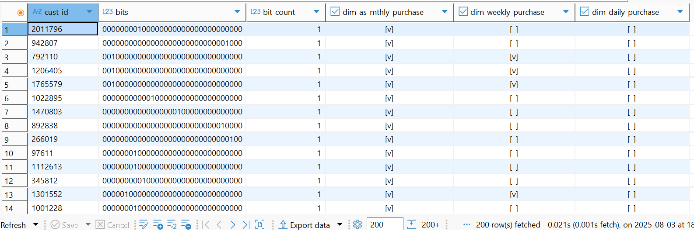

Cumulative table design for data compaction is shown below.

The data definition used in a Postgres database are as follows:

#Schema creation
CREATE SCHEMA Exercises;

#create struct datatype to hold the facts/drtails of the records

```
create type Exercises.order_info as (
	order_month text,
	order_num integer,
	Order_cost real,
	order_value real,
	order_profit real
);
```

#Enum data type to classify customers

```
create type Exercises.customer_class as enum ('regular','moderate shopper','bulk buyer');
```

#Customers are classifed as follows:
.1 Customers with more than with 20 or more monthly orders are 'bulk buyer'.
.2 Customers with orders greater than 10 and less than 21 per month are 'moderate shopper'
.3 Customers with 9 or less orders are regular shoppers

# The table use to show the temporal table (cumulative design)

```

create table Exercises.temp_dim_customers(
	cust_id integer,
	cust_name text,
	cust_gender text,
	cust_country text,
	cust_dob date,
	customer_category Exercises.customer_class,
	cust_info Exercises.order_info[],
	month_num integer,

	primary key (cust_id, month_num)
);
```

data definition
cust_id - customer identifier
cust_name - customer fullname
cust_gender - customer gender
cust_country - customer country
cust_dob - customer date of birth
customer_category - customer classification/category
cust_info - list of customers order details
month_num - A month number representing the month of purchasing starting from the begining of the analysis.

The compact customer table




Using the compact table design we can see we reduce daily sales records to one record per customer with the order details stored as a list of facts/orders.
We can expand the fact section to see the details of the order placed by the customers.
From the images we can see the second customer in our list made 3 puchases in September 2017 and 4 purchase in March 2019 and September 2020.

Using this table design we can also expand the customers records to display in a regular tabular fashion.


Further, we can using this cummulate design to check any customers growth between any period. In this example we measure growth using the value of the first purchase and the last purchase and the percentage growth in purchase value. EG We can see Karen Jones first purchase value was $11 and her last was $43,506.8 which represents a growth of almost 4000%.



We can also use the cumulative design pattern to analyse customers daily, weekly and monthly order patterns.

```

create table exercises.cust_cumulated(
	cust_id text,
	----list of dates in the past where the user was active
	purchase_dates date[],
	--date processing
	date date,
	primary key (cust_id, date)
);
```

We create the above data/table definition to store customer daily orders.
The table definition is as follows:
cust_id -customer identifier
purchase_dates - list of customer purchases
date - date of the month

We then populate the table with one month of customers' orders data from the sales table data.


We can use this data to analyse the customers' order pattern over the last day, week, month by computing the following dataset from the 'cust_cumulated' data.


-The 'bits' column contains a series of bit values with each value representing if a purchase was made by the customer on a given day. The days are numbered backwards with the leftmost value representing the last day in the month (0 - no purchase, 1 - purchase).
-The 'bit_count' column indicates the number of purchases made over the month by the customer.
-The 'dim_as_mthly_purchase' column indicates whether a purchase was made in the month by the customer.
-The 'dim_weekly_purchase' column indicates whether a purchase was made in the last week in the month by the customer.
-The 'dim_daily_purchase' column indicates whether a purchase was made on the last day in the month by the customer.
