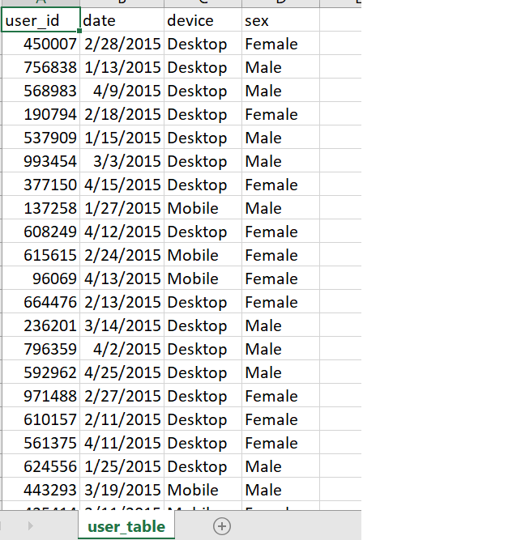
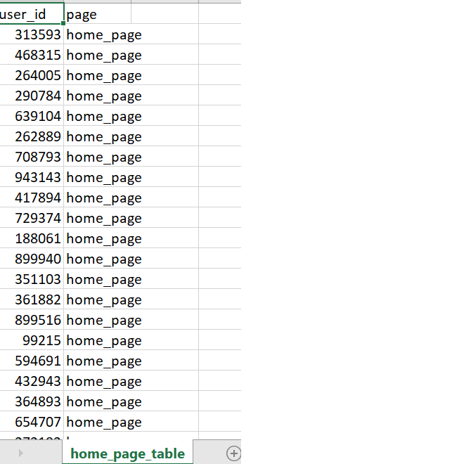
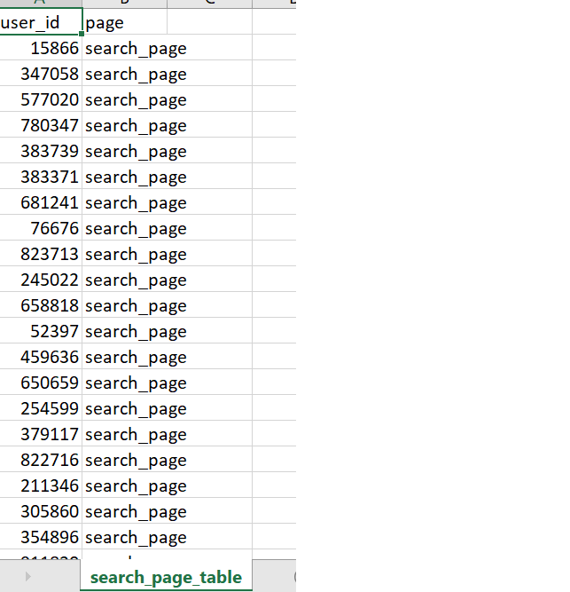
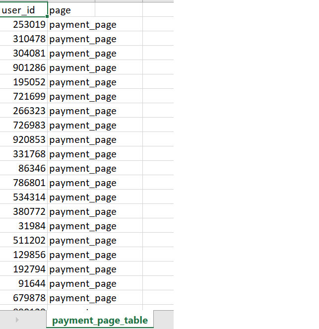
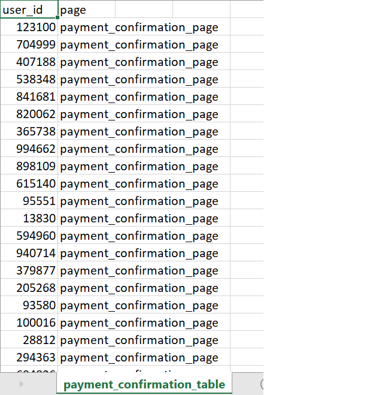
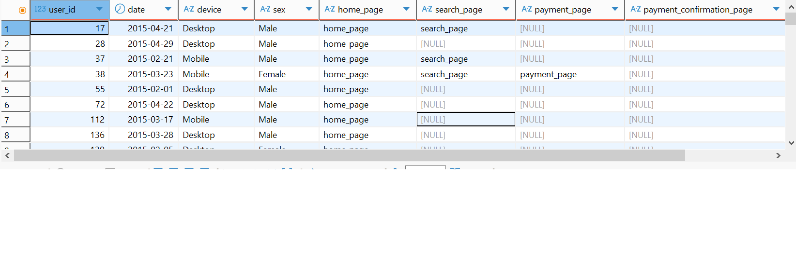
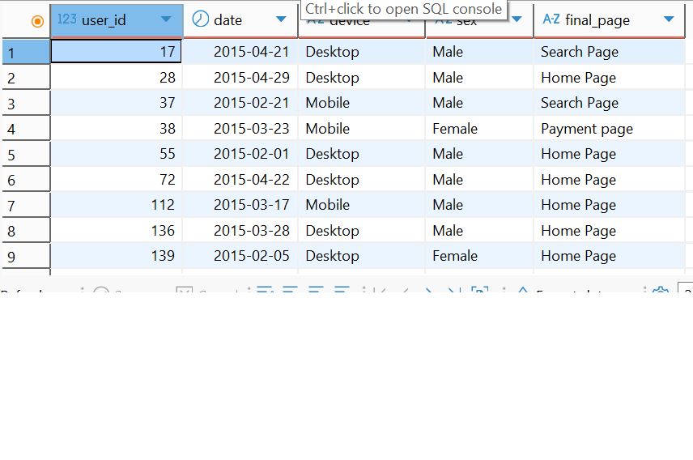
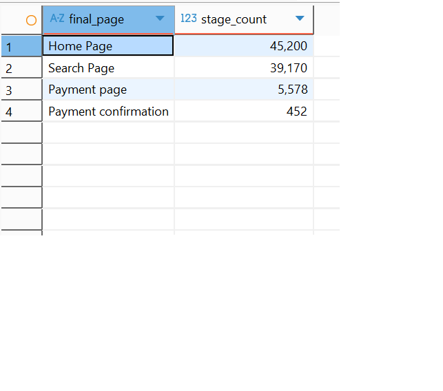
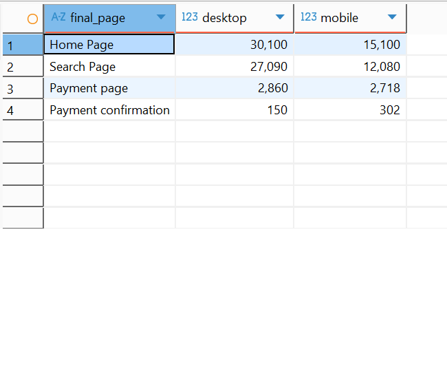
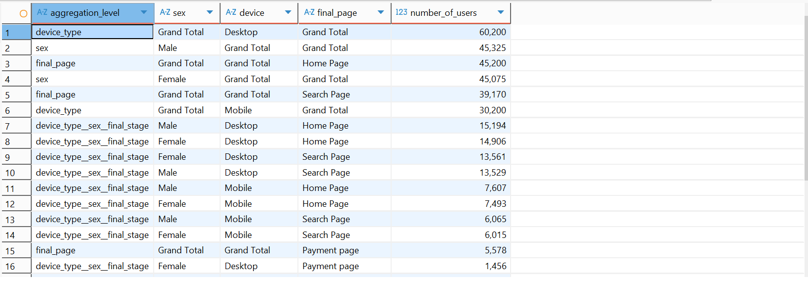

In this sesction we perform some funnel analyses activities.

This exercise uses data from the link 'https://www.kaggle.com/datasets/aerodinamicc/ecommerce-website-funnel-analysis'.

The datasets used in this exercise are:

The user dataset

The home page dataset

The search page dataset

The payment page dataset

The payment confirmation page dataset

We assume the users follow this path in the funnel.
home_page->search_page->payment_page->payment_confirmation_page

With this flow, we can identify conversion drop-offs, assess user behaviour by segments and suggest user experience and technical improvements based on the funnel performance.

We combined the page datasets into a single dataset to perform the funnel analysis.

We then determine the last stage in the funnel where the user drop off.

We can now summary the users by the stage they drop off.

Of the 90400 users  

45200 reached the home page and didn't proceed further.  
5578 reached the payment page ( 1-(payment page/(home_page users+search_page users+payment_page users)) 94% drop off from the home page)  
452 reached to payment confirmation page which represents a (452/94000) 4.8% conversion rate.  

Recommendations:  
improve Usability on home and search pages  
Simplify payment page  
Run A/B tests on home and search page layouts  

At the device level

We can see significant drop-offs from the 'search' to 'payment' and the 'payment' to payment confirmation' pages on both Desktop and Mobile devices. However, the drops are more pronounced on the Deskop device.

We should priortise improving usability and error tracking on the Desktop devices since these devices have more user activities.

Finally,

We can perform some group aggregation on the combined data.

We can observed that we have almost the same amount female users as male.  
Desktop users (60200) double Mobile users (30200).  
Females and males use Desktop and Mobile devices at the same rate.  
