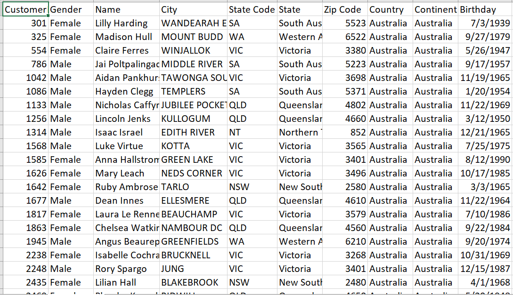
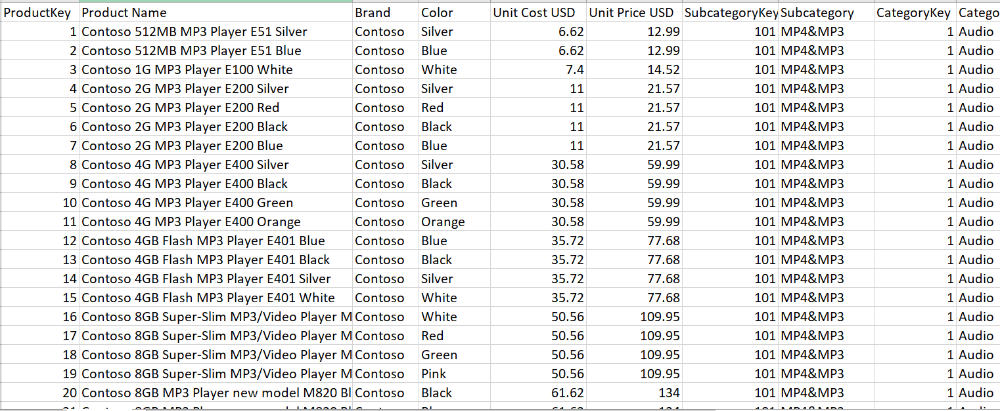

This repository uses data from this link - 'https://mavenanalytics.io/data-playground?order=date_added%2Cdesc&page=4&pageSize=5' to demonstrate data engineering and analytics concepts for general business and data analyses.

Note: no code will be shown in this repository except for the data definition.

The concepts demonstrated were developed using the Postgres object relational database. Postgres was chosen because it supports objects and array data types and makes implemetation easier.

Concepts covered in this repository:
.1 Cumulative data design for compact storage and analysis
.2 Reduced Fact data modelling.
.3 Repeated Data analysis (growth and survival analysis)
.4 Funnel Analysis

With each concept shown, we can do analyses from a single table once the data engineering as taken place. This reduces the need for expensive join operations and reduce storage thus increasing reporting performances especially on dashboards.

Shapshots of the datasets used in this repository are shown below:

Customers dataset -

Products dataset -

Sales Dataset -

