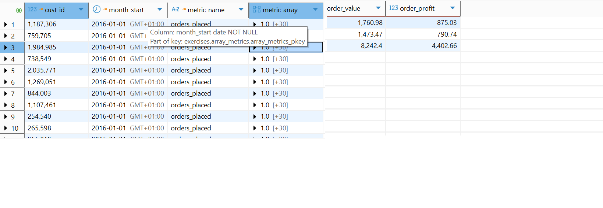
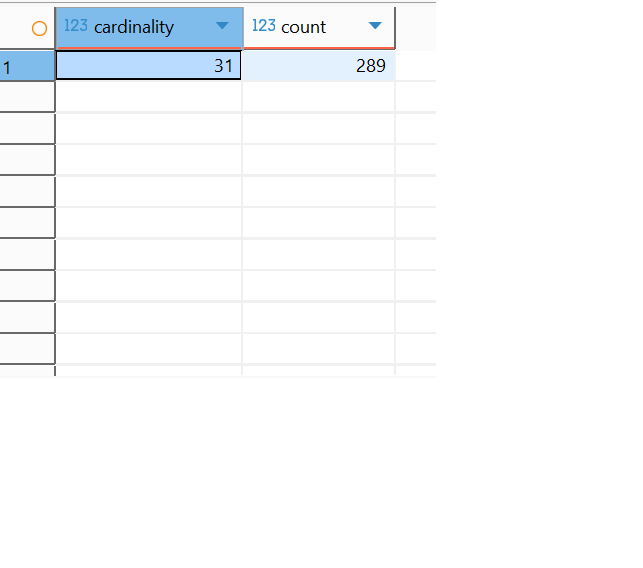
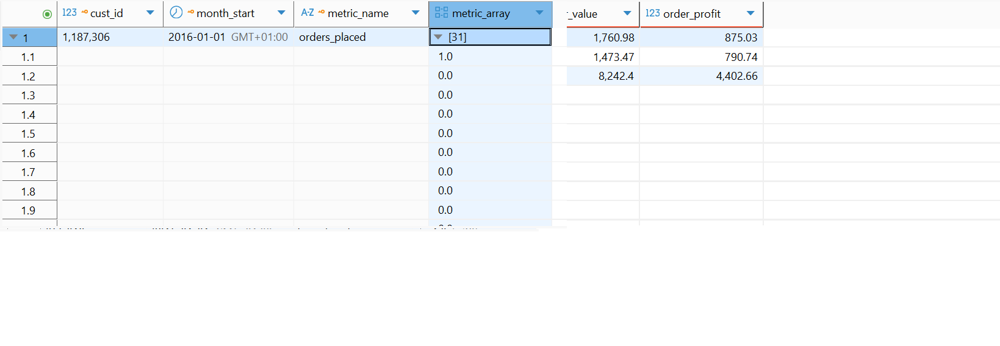
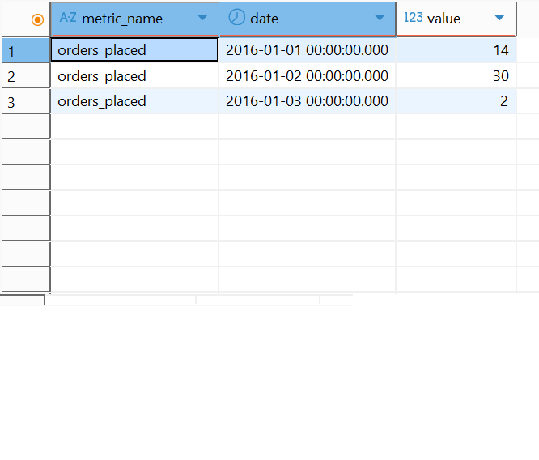

In this section we explore the reduce fact data modelling.

The model used in this section

```
create table exercises.array_metrics(
cust_id numeric,
month_start date,
metric_name text,
metric_array real[],
primary key(cust_id, month_start, metric_name)
);

```

#The definition of the table for the data

cust_id - customer identifier
month_start - the start of the month in which the transaction was done
metric_name - the name of the mertic being measured
metric_array - the mertic value sorted by day.

In this design if no purchase were done on a given day for a customer, we store 0 as the day value.

For this exercise we populated the array_metrics table with one month of data and we measure the number of orders placed as the metrics.


For data quality purposes, we can very the count of days populated for each customer.


We can see that each of the 289 customers have a 31 records which represents daily orders activity

in addition we can expand the metric array to see the days in which orders were placed. In this example, the customer place 1 order on January 1st, 2016 and no further orders were placed by the customer in the month.



Further, we can see the daily orders placed.

