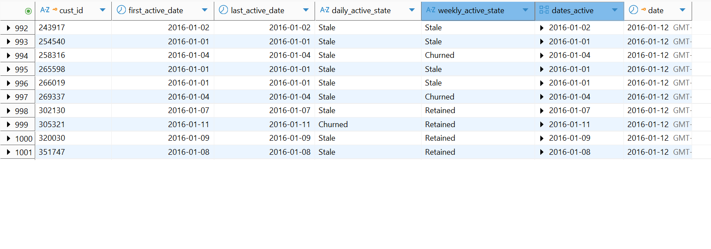
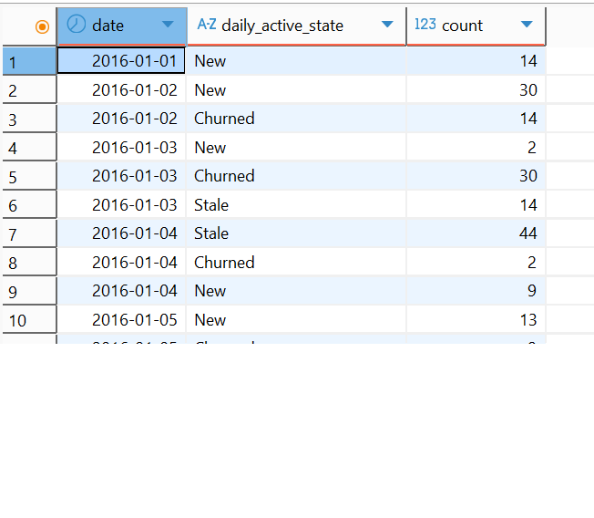
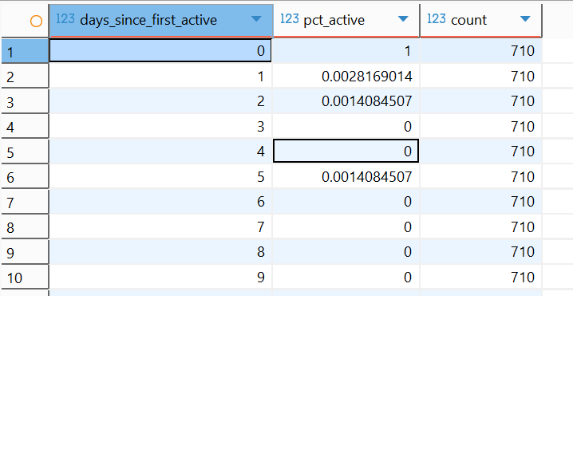
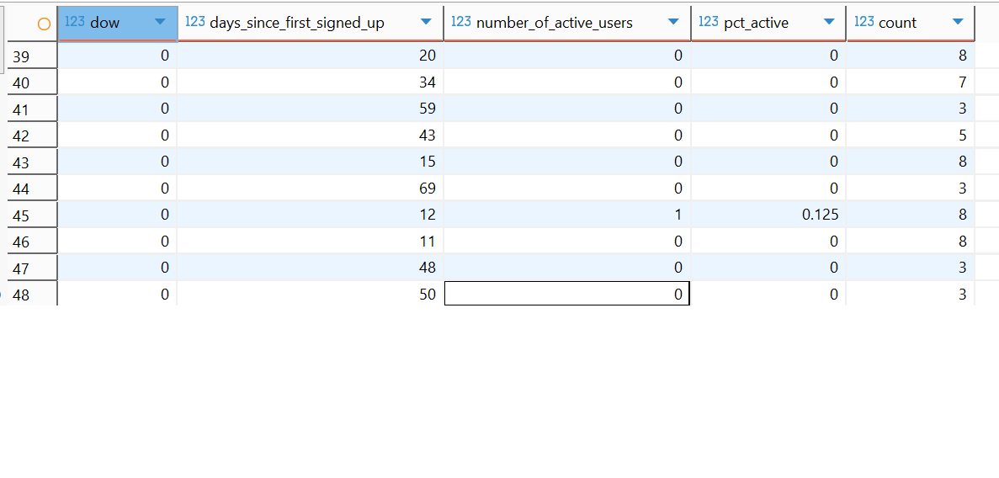

In this section we explore repeated analysis (growth and survivor)

Note: growth and survivor analyses are best used on subscrption data. However, for this excercise, we use the shopping data.
The data definition used for growth and survivor analysis is below.

```
create table exercises.cust_growth_accounting(
cust_id text,
first_active_date date,
last_active_date date,
daily_active_state text,
weekly_active_state text,
dates_active date[],
date date,
primary key (cust_id, date)
);
```

The definition detail - <br />

cust_id - customer identifier <br />
first_active_date - first active/order <br />
last_active_date - last active/order <br />
daily_active_state - daily active state of customer <br />
weekly_active_state - weelly active state of customer <br />
dates_active - list of active/order dates of the customer <br />
date date - active/order <br />

The customers state is defined below. <br />

`new (didnt exist yesterday, active today) <br />
-retained (active yesterday, active today) <br />
-churned(active yesterday, inactive today) <br />
-resurrected(inactive yesterday, active today) <br />
-stale(inactive yesterday, inactive today) <br />

Daily active states are classified as <br />
-customer didn't exist yesterday, but exist today (new) <br />
-customer was last active yesterday and is active today (retained) <br />
-customer wasn't active yesterday, but active today (ressurrected) <br />
-customer made no purchases today, but purchases today (churn) <br />
-customer is inactive for more than 2 days (stale) <br />

-active customer (new, retained, resurrected) <br />
-growth rate = new + resurrected -churned <br />

We see the customers state on any given day from the table.


In addition, we can look at the states summarised by day to to understand our customers growth over time.


Survivor analysis: <br />

We can examine the survivorship of over customers. From the data we can see that of 710 customers only 0.0014% of them makes a further purchase after 2 days of their initial purchase.


We can further analyse the data to examine survivorship by the day of the week. Those customers who made a purchase on sunday (dow = 0), only 1 (0.125%) of them made a subsequent purchase after 12 days of their initial purchase.

